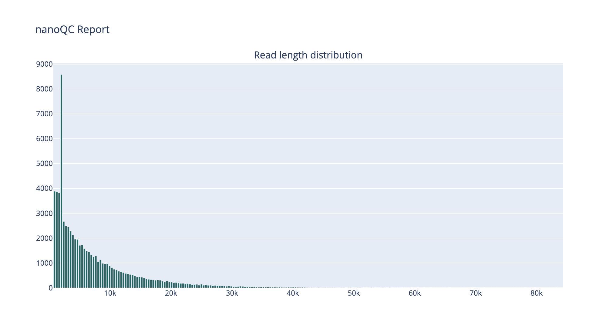
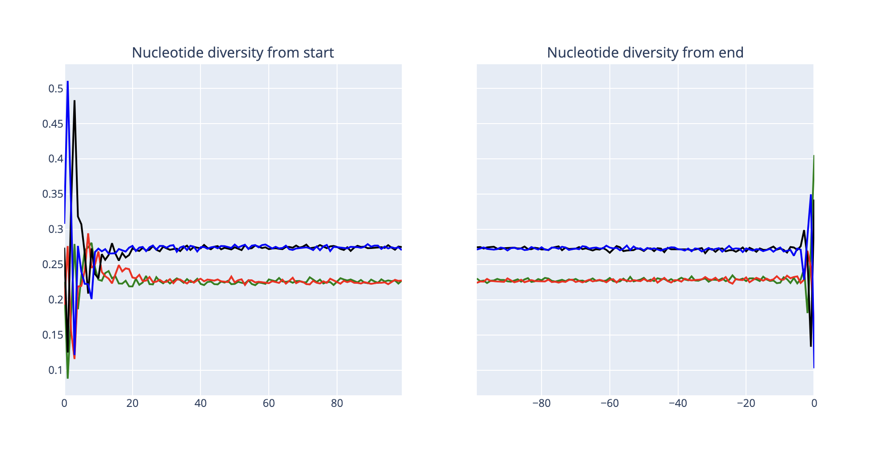
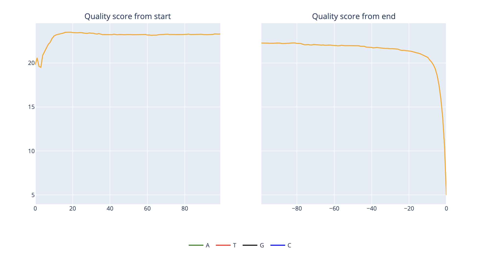
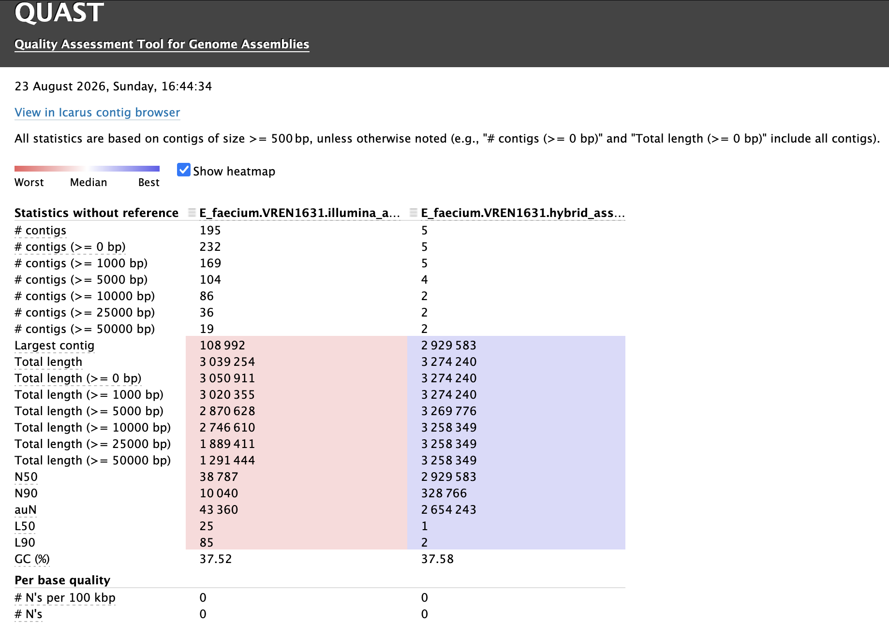

# Workshop Pathogen Genomics and AMR: Quality Assessment and AMR Interpretation Report

## Acknowledgements

These workshop is, in part, adapted from the original '[Computational practical 3: Accessing Data and Quality Control](https://github.com/WCSCourses/AMR_2026/blob/main/course_modules_2026/Data_access_QC/Computational_Practical_2_Accessing_Data_and_Quality_Control.md)' and '[Practical 4: Genome assembly and annotation](https://github.com/WCSCourses/AMR_2026/blob/main/course_modules_2026/genome_assembly/AMR_2026_Genome_assembly.md)' developed for the course [Antimicrobial Resistance in Bacterial Pathogens - Africa (2026)](https://github.com/WCSCourses/AMR_2026/tree/main), with further original contributions by Dr Francesc Coll. The original module developers include: Dr. Stanford Kwenda, Mr. Collins Kigen, Mr Mishalan Moodley, Augusto Messa Jr., Silondiwe Nzimande, Miriam Mwamba (QC of Illumina and ONT data) and Dr Fahad Khokhar (assembly QC).

## Table Of Contents
1. [Illumina Raw Sequencing Data Quality](#illuminaqc)
2. [ONT Raw Sequencing Data Quality](#ontqc)
3. [Illumina Read Cleaning and Pre-processing](#illuminacleaning)
4. [ONT Read Cleaning and Pre-processing](#ontcleaning)
5. [Sequencing Depth and Coverage](#depth)
6. [Genome Assembly Quality](#assemblyqc)
7. [Contamination and Data Integrity](#contamination)
8. [AMR detection with AMRFinderPlus](#amrfinderplus)
9. [Interpretation of AMR reports: case studies](#casestudies)
* [Resolving AMR phenotype-genotype discrepancies from *Salmonella enterica* genomes](#casestudy1)
* [Identifying linezolid-resistance point mutations from *Enterococcus faecium* genomes](#casestudy2)
* [Effect of duplicated and truncated AMR genes on genotypic AMR determination](#casestudy3)

   
## 1. Illumina Raw Sequencing Data Quality <a name="illuminaqc"></a>

First, navigate to the workshop directory, that is, the directory on your system where you downloaded the workshop GitHub project (```git clone https://github.com/francesccoll/teaching/```):
(replace ```teaching/sagesa_qc_amr/``` in the example below)
```
cd teaching/sagesa_qc_amr/
```

### Step 1.1: Download fastq files

```fastq-dl``` is a command-line tool for downloading sequencing FASTQ files from the ENA (European Nucleotide Archive) or NCBI SRA. You give it an accession (e.g. a BioProject, sample, experiment, or individual sequencing run), and it looks up the associated runs and downloads their FASTQs. By default, it tries ENA first and can fall back to SRA. The usual output is .fastq.gz files plus metadata such as run-info.tsv. If you have an SRA/ENA accession and just want the corresponding FASTQ files without manually finding FTP URLs or dealing with SRA conversion yourself, fastq-dl is a convenient option.

Activate ```fastq-dl``` conda environment and download the fastq.gz files of the following run accessions.
```
conda activate fastq-dl
fastq-dl --accession ERR4095909 --outdir ./data/
conda deactivate 
```

NOTE: as an alternative, fastq.gz files can also be downloaded with ```wget``` using corresponding FASTQ FTP URLs:
```
wget ftp://ftp.sra.ebi.ac.uk/vol1/fastq/ERR409/009/ERR4095909/ERR4095909_1.fastq.gz
wget ftp://ftp.sra.ebi.ac.uk/vol1/fastq/ERR409/009/ERR4095909/ERR4095909_2.fastq.gz
```

### Step 1.2: Running FastQC on Illumina fastqs

```
ls -lh ./data/ERR4095909*
```

You should see something like
<pre>
-rw-r-----+ 1 resh000371 csic108_res 109M Aug 23 11:42 ./data/ERR4095909_1.fastq.gz
-rw-r-----+ 1 resh000371 csic108_res 136M Aug 23 11:42 ./data/ERR4095909_2.fastq.gz
</pre>

Run the following command to run the fastqc tool on both the read files:
```
fastqc ./data/ERR4095909_1.fastq.gz ./data/ERR4095909_2.fastq.gz
```

Upon successful completion `fastqc` will create an analysis report in html format, one for each read file named after the name of the file you used as input. We can see the report by opening the html file in the web-browser.

### Step 1.3:  Opening the FastQC Report (GUI)

#### Basic statistics <a name="basics"></a>

 

This is a table containing basic information gleaned from the sequence reads such as total number of reads, length (range) of sequence reads and GC%. From this table alone, we can infer average coverage (total number of reads and length of reads) and compare the GC content with the species that we expect the isolate to belong to. In our example, we have an *Klebsiella pneumoniae* isolate that has a GC percent of 55-78%. This matches with the reported GC% of our reads. 

#### Per base sequence quality <a name="perbase"></a>

 

The **y-axis** shows the quality scores, while the **x-axis** represents the base positions within the reads. The **blue line** indicates the mean quality score at each position. The green, amber, and red regions represent **high, acceptable, and low-quality scores**, respectively. If the blue line enters the red region, the reads contain a higher proportion of low-quality bases and may have more sequencing errors. In such cases, **trimming low-quality bases may be necessary before downstream analysis**.

#### Per sequence quality <a name="persequence"></a>

 

The Per Sequence Quality Scores plot shows the overall quality of the reads. The x-axis represents the mean quality score per read, while the y-axis shows the number of reads at each score. A high proportion of low-quality reads may indicate a systematic sequencing problem, potentially affecting only part of the run.

#### Per sequence GC content <a name="persequencegc"></a>

 

The figure shows the theoretical distribution of GC content per sequence based on the GC percent of the genome, and the actual distribution in your sample. In a normal random library you have a roughly normal distribution of GC content (a single peak) where the peak corresponds to the overall GC content of the underlying genome. An unusually shaped distribution could indicate a contaminated library or some other kind of bias in library prep. 

#### Per base N content <a name="perbasen"></a>

 

If a sequencer is unable to make a base call with sufficient confidence then it will normally substitute an N rather than a conventional base call. This module plots out the percentage of base calls at each position for which an N was called. It's not unusual to have a very low proportion of Ns especially nearer the end of reads. However, if proportion is higher that could cause problems in downstream analysis.

#### Sequence duplication <a name="duplication"></a>

 

This figure shows the proportion of unique and duplicated sequences in the library. Low duplication is generally expected, while high duplication may indicate high sequencing coverage or enrichment bias, such as PCR overamplification.

#### Adapter content <a name="adapters"></a>

 

It is important to ensure that the sequence reads are not contaminated with adapter sequences used in library preparation. This module reports the abundance of various adapters used in sequencing. The plot above shows a cumulative percentage count of the proportion of the reads at each position that matches adapter sequences. Once a sequence has been seen in a read, it is counted as being present right through to the end of the read so the percentages you see will only increase as the read length goes on. 

From all the above data metrics it appears that the sequence reads of the isolate ERR4095909 are of good quality and can be used to run the downstream analysis.

## 2. ONT Raw Sequencing Data Quality <a name="ontqc"></a>

## Step 2.1: Quality Control with NanoQC and NanoPlot

First, we will download the raw ONT sequence data of a *K. pneumoniae* strain through their run accession (ERR8282741). Activate ```fastq-dl``` conda environment and download the fastq.gz files:.

```
conda activate fastq-dl
fastq-dl --accession ERR8282741 --outdir ./data/
conda deactivate 
```

Make sure that fastq file has been downloaded:
```
ls -lh ./data/ERR8282741.fastq.gz
```
 
Next, we will run NanoQC. NanoQC is a quality-control tool specifically designed for Oxford Nanopore sequencing data. It analyses FASTQ files and generates reports summarizing read quality and characteristics, such as read length, quality scores, and sequencing quality distributions. It is mainly used to assess the overall quality of Nanopore sequencing data before downstream analysis and identify potential problems with the sequencing run.

```
conda activate nanoqc
nanoQC ./data/ERR8282741.fastq.gz -o ERR8282741_qc_output
conda deactivate
```

Double click on the ```./ERR8282741_qc_output/nanoQC.html``` to visualise NanoQC report.

#### Read length distribution <a name="nanoqc_read_lengths"></a>

 

The read length distribution plot produced by NanoQC show the distribution of read lengths in an ONT fastq file. It indicates the typical read length, the range of read lengths, and the presence of unusually short or long reads, providing an overview of the sequencing output and read-length characteristics.

#### Nucleotide diversity <a name="nanoqc_nuc_div"></a>

 

The nucleotide diversity plot above shows the relative frequency of A, T, G and C across the reads. Nucleotide composition is relatively stable throughout most of the reads, but pronounced variation is observed at the 5′ and 3′ termini, indicating positional nucleotide bias at the read ends. The stable composition across the central region suggests relatively consistent sequence composition, while the terminal deviations may reflect technical or sequencing-related effects.

#### Quality score <a name="nanoqc_quality_score"></a>

 

The reads show generally good and stable sequencing quality, with minor variability at the beginning and a pronounced quality deterioration at the very end of the reads. Trimming the terminal low-quality bases will be appropriate. 

Finally, we will run NanoPlot on the same ONT data. NanoPlot is a bioinformatics tool for quality assessment and statistical characterization of Oxford Nanopore sequencing data. It generates graphical and numerical summaries of read length distributions, quality scores, sequencing yield, and other read-level metrics, enabling evaluation of data quality and identification of potential sequencing biases or anomalies prior to downstream analysis.

```
conda activate nanoplot
NanoPlot --fastq ./data/ERR8282741.fastq.gz -o ERR8282741_qc_output
conda deactivate
```

Visualize the Summary statistics produced by NanoPlot ```NanoStats.txt```:
```
cat ./ERR8282741_qc_output/NanoStats.txt
```

## 3. Illumina Read Cleaning and Pre-processing <a name="illuminacleaning"></a>

## Step 3.1: Run fastp

```fastp``` is a fast tool for quality control and preprocessing of FASTQ sequencing data. It is commonly used to:
* Trim low-quality bases and sequencing adapters.
* Filter out poor-quality or very short reads.
* Remove adapter contamination from Illumina reads.
* Generate quality-control reports before and after filtering.
* Process paired-end reads while maintaining read pairing.

In a typical Illumina workflow, ```fastp``` is used after sequencing and before downstream analyses, such as alignment or variant calling, to improve the quality of the input reads.

Activate the conda environment of ```fastp``` and run it for the fastq.gz files of ERR4095909:

```
conda activate fastp
fastp --in1 ./data/ERR4095909_1.fastq.gz --in2 ./data/ERR4095909_2.fastq.gz --out1 ERR4095909_1.trimmed.fastq.gz --out2 ERR4095909_2.trimmed.fastq.gz --length_required 40 --cut_front --cut_tail --cut_mean_quality 20
conda deactivate
```

In the command above we have used a number of options which are explained below:
| Parameter | Description |
|------------|------------|
| `--in1` and `--in2` | Input files containing raw sequencing data from Read 1 and Read 2. |
| `--out1` and `--out2` | Output files containing reads remaining after trimming and filtering. |
| `--cut_front` | Trims low-quality bases from the start of the read using a sliding window. Bases are removed if the mean quality in the window is below the threshold; trimming stops once quality exceeds the threshold. |
| `--cut_tail` | Performs the same sliding window trimming as `--cut_front`, but starts from the end of the read and moves toward the front. |
| `--cut_mean_quality` | Sets the quality threshold used by both `--cut_front` and `--cut_tail`. |
| `--length_required` | Removes reads that fall below this minimum length after trimming low-quality bases. |
| `fastp` (default behavior) | Performs additional quality filtering by default: trims adapter sequences, removes reads with excessive Ns, discards reads that are too short after filtering, and retains only properly paired reads (if one read fails QC, its mate is also removed). |

fastp will also generate an HTML file (default name is fastp.html) with more information on the trimming and some other QC information - open this file in a web browser to see the output.

 

**❓ Question** How many reads were removed by fastp due to a) low quality, b) too many Ns, and c) were too short after filtering?**

## 4. ONT Read Cleaning and Pre-processing <a name="ontcleaning"></a>

## Step 4.1: Adapter Trimming with Porechop
```
conda activate porechop
porechop -i ./data/ERR8282741.fastq.gz -o ./data/ERR8282741_trimmed.fastq.gz
conda deactivate
```
```
conda activate filtlong
filtlong --keep_percent 90 ./data/ERR8282741_trimmed.fastq.gz > ./data/ERR8282741_filtered.fastq
```
```
filtlong --min_length 1000 ./data/ERR8282741_filtered.fastq > ./data/ERR8282741_filtered_min1k.fastq
conda deactivate
```

## 5. Sequencing Depth and Coverage <a name="depth"></a>

### Map paired-end reads using Snippy

```
conda activate snippy
snippy \
  --cpus 8 \
  --ref ./data/Enterococcus_faecium_Aus0004.CP003351.2.gb \
  --R1 ./data/ERR1557083_1.fastq.gz \
  --R2 ./data/ERR1557083_2.fastq.gz \
  --outdir ./results/ERR1557083_snippy
```

### Calculate per-base depth 

```
samtools depth -a ./results/ERR1557083_snippy/snps.bam > ./results/ERR1557083_snippy/depth.txt
```

### Calculate mean depth of coverage

```
awk '{sum += $3; n++} END {print "Mean depth:", sum/n}' \
  ./results/ERR1557083_snippy/depth.txt
```

### Calculate breadth of coverage

```
for threshold in 1 20 50 100; do
    awk -v t=$threshold '$3 >= t {covered++} END {
        printf ">=%dx coverage: %.2f%%\n", t, 100*covered/NR
    }' ./results/ERR1557083_snippy/depth.txt
done
```


## 6. Genome Assembly Quality <a name="assemblyqc"></a>

### Step 6.1 Downloading Illumina genome assemblies from AllTheBacteria
```
atb info SAMN11579777
```
```
wget https://allthebacteria-assemblies.s3.eu-west-2.amazonaws.com/SAMN11579777.fa.gz
```
```
gunzip SAMN11579777.fa.gz
mv SAMN11579777.fa ./data/E_faecium.kerschner2019.Ef-11.fa
```

Count how many contigs the Illumina assembly has:
```
grep -c ">" ./data/E_faecium.kerschner2019.Ef-11.fa
```

### Step 6.2 Assessing assembly quality with QUAST

QUAST (Quality Assessment Tool for Genome Assemblies) is a bioinformatics tool used to evaluate the quality and structural characteristics of genome assemblies. It calculates metrics such as total assembly length, number of contigs, N50/N90, largest contig, GC content, and misassemblies. When a reference genome is available, QUAST can additionally assess assembly accuracy, genome coverage, and structural discrepancies relative to the reference.

```
quast -h
```

As an example of use, we will calculate the assembly stats of an Illumina and hybrid assembly obtained for the same *E. faecium* strain:

```
quast \
./data/E_faecium.VREN1631.illumina_assembly.fna \
./data/E_faecium.VREN1631.hybrid_assembly.fna \
-o ./results/quast/
```

Navigate to the directory ```./results/quast/``` to explore the reports generated by QUAST. Double click on the `report.html`.

 

### Step 6.3 Assessing assembly quality with BUSCO markers


## 7. Contamination and Data Integrity <a name="contamination"></a>

### Step 7.1 Using CheckM2 to predict genome completeness

CheckM2 is a machine-learning-based bioinformatics tool used to assess the quality of microbial genome assemblies and metagenome-assembled genomes (MAGs). It predicts genome completeness and contamination based primarily on the presence and abundance of protein-coding genes, providing an estimate of how much of the expected genome is represented and whether additional genomic material may be present.

Before using CheckM2, its database must be downloaded:
```
conda activate checkm2
checkm2 database --download --path ./data/
```

We will run CheckM2 on the same two assemblies we run QUAST on:

```
checkm2 predict --allmodels --lowmem --remove_intermediates --threads 8 --input ./data/E_faecium.VREN1631.illumina_assembly.fna --output-directory ./results/checkm2_results
```

Next, we will rename CheckM2's report:

```
mv ./results/checkm2_results/quality_report.tsv ./results/E_faecium.VREN1631.illumina_assembly.quality_report.tsv
```

And run it for the hybrid assembly of the same strain:

```
checkm2 predict --allmodels --lowmem --remove_intermediates --threads 8 --input ./data/E_faecium.VREN1631.hybrid_assembly.fna --output-directory ./results/checkm2_results --force
```
```
mv ./results/checkm2_results/quality_report.tsv ./results/E_faecium.VREN1631.hybrid.assembly.quality_report.tsv
```

### Step 7.2 Using Sylph to identify taxonomic identity and contamination

Sylph is a fast metagenomic profiling tool that identifies microorganisms present in shotgun sequencing data and estimates their relative abundance. Even in cases where a single bacterial isolate is been sequenced, we can use taxonomic classifiers like Sylph to check for contaminants different from our target and expected organism.

If you have not done it already, make sure the Sylph database is downloaded first:
```
wget http://faust.compbio.cs.cmu.edu/sylph-stuff/gtdb-r220-c200-dbv1.syldb
```

Next, we will download the Illumina fastq files of the same *E. faecium* strain we analyzed with CheckM2:

```
conda activate fastq-dl
fastq-dl --accession ERR1557083 --outdir ./data/
conda deactivate
```

```
conda activate sylph
sylph profile gtdb-r220-c200-dbv1.syldb -1 ./data/ERR1557083_1.fastq.gz -2 ./data/ERR1557083_2.fastq.gz -t 8 > ./results/ERR1557083.profiling.tsv
conda deactivate
```

## 8. AMR detection with AMRFinderPlus <a name="amrfinderplus"></a>

AMRFinderPlus is a bioinformatics tool from the NCBI for detecting antimicrobial resistance (AMR) genes and resistance-associated mutations in bacterial genomes or protein sequences. You can use the command below to run AMRFinderPlus on the same bacterial assembly. We will run and interpret AMRFinderPlus reports more extensively in the next case studies.

```
conda activate amrfinder

amrfinder -n ./data/E_faecium.VREN1631.illumina_assembly.fna -O Enterococcus_faecium -o E_faecium.VREN1631.illumina_assembly.amrfinder.txt -d ./data/amrfinder_db/latest

conda deactivate
```

## 9. Interpretation of AMR reports: case studies <a name="casestudies"></a>

### 9.1 Resolving AMR phenotype-genotype discrepancies from *Salmonella enterica* genomes <a name="casestudy1"></a>

In this exercise we will AMRFinder to detect AMR from whole genome sequences of *Salmonella enterica* with a focus on cases of AMR genotype-phenotype discrepancies described in [this study](https://www.sciencedirect.com/science/article/pii/S0740002020301192).

The table below includes the phenotypic antibiogram of four *Salmonella enterica* strains.

| Strain ID | Ampicillin | Piperacillin | Amoxicillin/clavulanate | Chloramphenicol | Colistin | Fosfomycin | Trimethoprim/sulfamethoxazole | Amikacin | Gentamicin | Tobramycin | Tetracycline |
|-----------|------------|--------------|-------------------------|-----------------|----------|------------|-------------------------------|----------|------------|------------|--------------|
| B27 | >8 (R) | >16 (R) | >8/4 (R) | >8 (R) | >2 (R) | >32 (R) | >4/76 (R) | ≤8 (S) | >4 (R) | >4 (R) | >8 (R) |
| WD17 | >8 (R) | 16 (I) | ≤2/1 (S) | ≤8 (S) | ≤2 (S) | ≤32 (S) | ≤2/38 (S) | ≤8 (S) | ≤2 (S) | ≤2 (S) | ≤4 (S) |
| WT5 | >8 (R) | >16 (R) | >8/4 (R) | >8 (R) | ≤2 (S) | ≤32 (S) | >4/76 (R) | ≤8 (S) | ≤2 (S) | ≤2 (S) | >8 (R) |
| WW28B | >8 (R) | >16 (R) | 8/4 (S) | >8 (R) | ≤2 (S) | >32 (R) | >4/76 (R) | ≤8 (S) | ≤2 (S) | ≤2 (S) | >8 (R) |

And the table below reported cases of AMR genotype-phenotype discrepancies:

| Strain ID | Nature of Error | Genotype-Phenotype Disagreement |
|-----------|-----------------|---------------------------------|
| B27 | False negative | Amoxicillin/clavulanate resistance without any resistance determinant |
| B27 | False negative | Colistin resistance without any resistance determinant |
| B27 | False positive | Amikacin susceptibility despite presence of *aac(6′)-Iaa* gene |
| WD17 | False negative | Ampicillin resistance without any resistance determinant |
| WD17 | False positive | Amikacin and tobramycin susceptibility despite presence of *aac(6′)-Iaa* gene |
| WT5 | False negative | Amoxicillin/clavulanate resistance without any resistance determinant |
| WT5 | False positive | Amikacin and tobramycin susceptibility despite presence of *aac(6′)-Iaa* gene |
| WW28B | False negative | Fosfomycin resistance without any resistance determinant |
| WW28B | False positive | Amikacin and tobramycin susceptibility despite presence of *aac(6′)-Iaa* gene |

Now, run AMRFinder for all four *Salmonella* genomes by executing the commands below:

```
conda activate amrfinder

amrfinder -n ./data/Salmonella_enterica.B27.fna -O Salmonella -o Salmonella_enterica.B27.amrfinder.txt -d ./data/amrfinder_db/latest

amrfinder -n ./data/Salmonella_enterica.WD17.fna -O Salmonella -o Salmonella_enterica.WD17.amrfinder.txt -d ./data/amrfinder_db/latest

amrfinder -n ./data/Salmonella_enterica.WT5.fna -O Salmonella -o Salmonella_enterica.WT5.amrfinder.txt -d ./data/amrfinder_db/latest

amrfinder -n ./data/Salmonella_enterica.WW28B.fna -O Salmonella -o Salmonella_enterica.WW28B.amrfinder.txt -d ./data/amrfinder_db/latest
```

**❓ Question**
All four *Salmonella* strains are resistant to ampicillin according to phenotypic testing. Can you identify which resistance determinant(s) are responsible for phenotypic resistance to ampicillin in each strain? Do all four strains carry at least one resistance determinant that could explain ampicillin resistance?

**❓ Question**
Three *Salmonella* strains are resistant to trimethoprim/sulfamethoxazole. Can you identify the AMR genes responsible for resistance to this antibiotic combination?

**❓ Question**
Two *Salmonella* strains (B27 and WW28B) are resistant to fosfomycin. Can you identify the AMR gene(s) responsible for resistance to this antibiotic?

**❓ Question**
For false negatives, i.e. phenotypically resistant strains without any resistance determinant detected by AMRFinder, could you hypothesise what biological phenomenon may be responsible for such discrepancies?


### 9.2 Identifying linezolid-resistance point mutations from *Enterococcus faecium* genomes <a name="casestudy2"></a>

Linezolid, an oxazolidinone antibiotic that inhibits protein synthesis by binding to the 50S subunit of the 23S rRNA, is considered a last-resort treatment option for vancomycin-resistant Enterococci (VRE). However, linezolid resistance has been reported in *E. faecium*, with the most prevalent resistance mechanisms involving mutations within the V domain of the 23S rRNA. In this exercise, we will analyse the genomes of four linezolid resistant VRE strains that originated from a [hospital outbreak in Austria](https://link.springer.com/article/10.1186/s13756-019-0598-z). We will evaluate the ability of different bioinformatic tools to detect linezolid resistance genetic markers from Illumina sequence data. The table below includes the accessions, isolate Ids, and linezolid MIC of the VRE genomes we will analyse:

| Illumina run accession | Isolate ID | Biosample accession | Linezolid MIC | Linezolid resistance |
| ---------------------- | ---------- | ------------------- | ------------- | -------------------- |
| SRR9027862             | Ef-39      | SAMN11579813        | 4             | R                    |
| SRR9027818             | Ef-07      | SAMN11579756        | 16            | R                    |
| SRR9027816             | Ef-09      | SAMN11579758        | 16            | R                    |
| SRR9027815             | Ef-11      | SAMN11579777        | >256          | R                    |

First, move to the working directory and list the genome assembly files we will analyse:
```
ls ./data/E_faecium.kerschner2019.*
```

You should see the four files listed as shown below:
<pre>
./data/E_faecium.kerschner2019.Ef-07.fa  ./data/E_faecium.kerschner2019.Ef-11.fa
./data/E_faecium.kerschner2019.Ef-09.fa  ./data/E_faecium.kerschner2019.Ef-39.fa
</pre>

These four Illumina assemblies were downloaded using AllTheBacteria command-line tool (```atb info``` command) as explained in section 6.1. Now, run the commands below to execute AmrFinderPlus on each of the four *E. faecium* Illumina assemblies:

Remember that the amrfinder database must be downloaded first:
```
mkdir ./data/amrfinder_db
conda activate amrfinder
amrfinder_update -d ./data/amrfinder_db
```

```
conda activate amrfinder
amrfinder -n ./data/E_faecium.kerschner2019.Ef-07.fa -O Enterococcus_faecium -o E_faecium.kerschner2019.Ef-07.amrfinder.txt -d ./data/amrfinder_db/latest
amrfinder -n ./data/E_faecium.kerschner2019.Ef-09.fa -O Enterococcus_faecium -o E_faecium.kerschner2019.Ef-09.amrfinder.txt -d ./data/amrfinder_db/latest
amrfinder -n ./data/E_faecium.kerschner2019.Ef-11.fa -O Enterococcus_faecium -o E_faecium.kerschner2019.Ef-11.amrfinder.txt -d ./data/amrfinder_db/latest
amrfinder -n ./data/E_faecium.kerschner2019.Ef-39.fa -O Enterococcus_faecium -o E_faecium.kerschner2019.Ef-39.amrfinder.txt -d ./data/amrfinder_db/latest
```

Now, pay particular attention to the output files of AMRFinder, those ending in ```.amrfinder.txt```. See if AMRFinder has found any genetic marker responsible for linezolid resistance in these genomes.

Next, we will used a specialized tool called [LRE-Finder](https://pubmed.ncbi.nlm.nih.gov/30863844/)), a tool developed to detect genetic markers of linezolid resistance in enterococci from whole-genome sequences. As this tools accepts raw Illumina reads as input, we will download the Illumina fastq.gz files using ```fastq-dl```:

```
conda activate fastq-dl

fastq-dl --accession SRR9027862
fastq-dl --accession SRR9027818
fastq-dl --accession SRR9027816
fastq-dl --accession SRR9027815

mv *.fastq.gz ./data/
```

After downloading the fastq files, run the following ```LRE-Finder.py``` commands:

```
LRE-Finder.py -ipe ./data/SRR9027862_1.fastq.gz ./data/SRR9027862_2.fastq.gz -o SRR9027862_lre-finder -t_db ./data/elmDB/elm -ID 80 -1t1 -cge -matrix
LRE-Finder.py -ipe ./data/SRR9027818_1.fastq.gz ./data/SRR9027818_2.fastq.gz -o SRR9027818_lre-finder -t_db ./data/elmDB/elm -ID 80 -1t1 -cge -matrix
LRE-Finder.py -ipe ./data/SRR9027816_1.fastq.gz ./data/SRR9027816_2.fastq.gz -o SRR9027816_lre-finder -t_db ./data/elmDB/elm -ID 80 -1t1 -cge -matrix
LRE-Finder.py -ipe ./data/SRR9027815_1.fastq.gz ./data/SRR9027815_2.fastq.gz -o SRR9027815_lre-finder -t_db ./data/elmDB/elm -ID 80 -1t1 -cge -matrix
```

Now, pay attention to the output messages of LRE-Finder on your screen, particularly the linezolid mutations found, and the "Wild type ratio", "Mutant type ratio", and "Predicted phenotype" of each mutation. Check if LRE-Finder has found any genetic marker responsible for linezolid resistance in these genomes, and compare the output of LRE-Finder with that of AMRFinder for the corresponding genomes.

**❓ Question**
Are there any discrepancies in the linezolid resistance markers found? if so, what could explain these discrepancies?

### 9.3 Effect of duplicated and truncated AMR genes on genotypic AMR determination <a name="casestudy3"></a>

Tetracycline resistance in *E. faecium* is primarily mediated by ribosomal protection proteins encoded by *tet(M)* and efflux pumps encoded by *tet(L)*. *tet(M)* is among the most prevalent tetracycline resistance genes in this species and is often carried on mobile genetic elements (MGEs). The authors of a [recent study](https://www.biorxiv.org/content/10.64898/2026.06.08.729070v1.full) identified many false negatives when predicting tetracycline resistance using AMRFinder from Illumina genome assemblies. They noticed that many of these false negatives (i.e. tetracycline resistant strains by phenotypic AST lacking *tet* genes in their genome) actually carried partially detected *tet(M)* genes. In this exercise, we will interrogate Illumina and hybrid assemblies to investigate the source of tetracycline genotype-phenotype discrepancies.

First, we will use the original Illumina assemblies to identify resistance markers with AMRFinder:

```
conda activate amrfinder

amrfinder -n ./data/E_faecium.IVR212.illumina_assembly.fna -O Enterococcus_faecium -o E_faecium.IVR212.illumina_assembly.amrfinder.txt -d ./data/amrfinder_db/latest

amrfinder -n ./data/E_faecium.VREN0576.illumina_assembly.fna -O Enterococcus_faecium -o E_faecium.VREN0576.illumina_assembly.amrfinder.txt -d ./data/amrfinder_db/latest

amrfinder -n ./data/E_faecium.VREN1631.illumina_assembly.fna -O Enterococcus_faecium -o E_faecium.VREN1631.illumina_assembly.amrfinder.txt -d ./data/amrfinder_db/latest
```

**❓ Question**
Has AMRFinder identified any *tet* genes that could explain phenotypic tetracycline resistance of these strains?
```grep "tet" *illumina_assembly.amrfinder.txt```

Next, we will lower the minimum coverage to detect an AMR gene with AMRFinder down to 30% (--coverage_min 0.3) from the default 50% to see if any new AMR gene is identified by AMRFinder:

```
amrfinder -n ./data/E_faecium.IVR212.illumina_assembly.fna -O Enterococcus_faecium -o E_faecium.IVR212.illumina_assembly.amrfinder.0.3.txt -d ./data/amrfinder_db/latest --coverage_min 0.3 

amrfinder -n ./data/E_faecium.VREN0576.illumina_assembly.fna -O Enterococcus_faecium -o E_faecium.VREN0576.illumina_assembly.amrfinder.0.3.txt -d ./data/amrfinder_db/latest --coverage_min 0.3 

amrfinder -n ./data/E_faecium.VREN1631.illumina_assembly.fna -O Enterococcus_faecium -o E_faecium.VREN1631.illumina_assembly.amrfinder.0.3.txt -d ./data/amrfinder_db/latest --coverage_min 0.3 
```

**❓ Question**
Has AMRFinder identified any *tet* genes after lowering the minimum gene coverage threshold? In what coverage?
```grep "tet" *illumina_assembly.amrfinder.0.3.txt```

Finally, we will run AMRFinder on hybrid assemblies (closed genomes) produced by sequencing all three strains with both Illumina and ONT:

```
amrfinder -n ./data/E_faecium.IVR212.hybrid_assembly.fna -O Enterococcus_faecium -o E_faecium.IVR212.hybrid_assembly.amrfinder.txt -d ./data/amrfinder_db/latest

amrfinder -n ./data/E_faecium.VREN0576.hybrid_assembly.fna -O Enterococcus_faecium -o E_faecium.VREN0576.hybrid_assembly.amrfinder.txt -d ./data/amrfinder_db/latest

amrfinder -n ./data/E_faecium.VREN1631.hybrid_assembly.fna -O Enterococcus_faecium -o E_faecium.VREN1631.hybrid_assembly.amrfinder.txt -d ./data/amrfinder_db/latest
```

**❓ Question**
Has AMRFinder identified any *tet* genes in the hybrid assemblies? How many copies and in what coverage?
```grep "tet" *hybrid_assembly.amrfinder.txt```

**❓ Question**
Based on the results of AMRFinder from Illumina and hybrid assemblies, which results would you trust more? what could explain the lack of full *tet(M)* detection in the Illumina assemblies?

